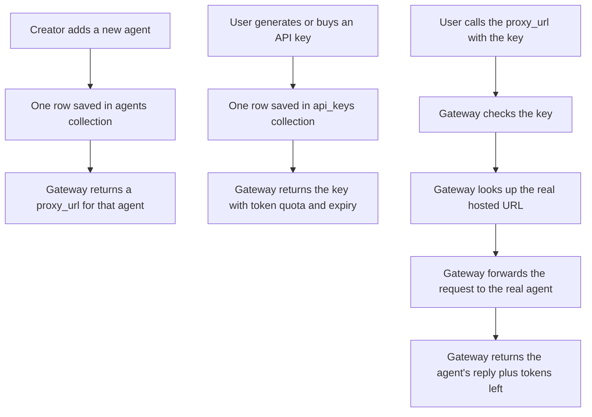
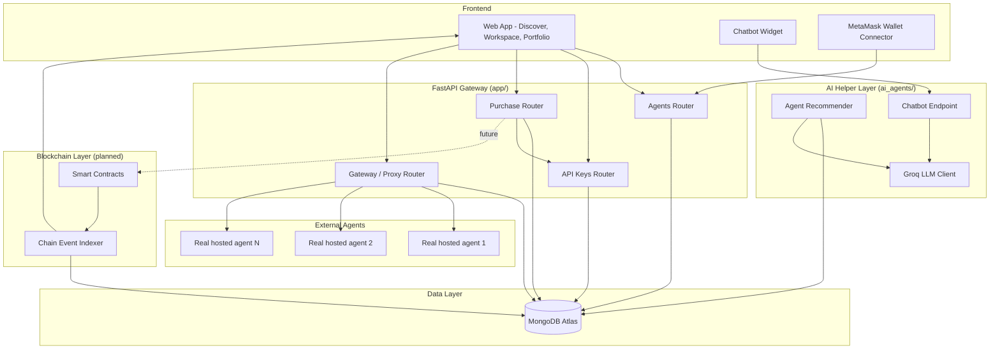
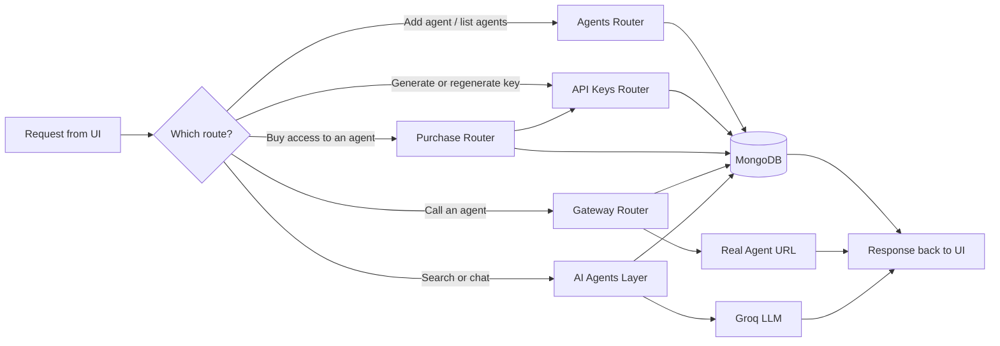
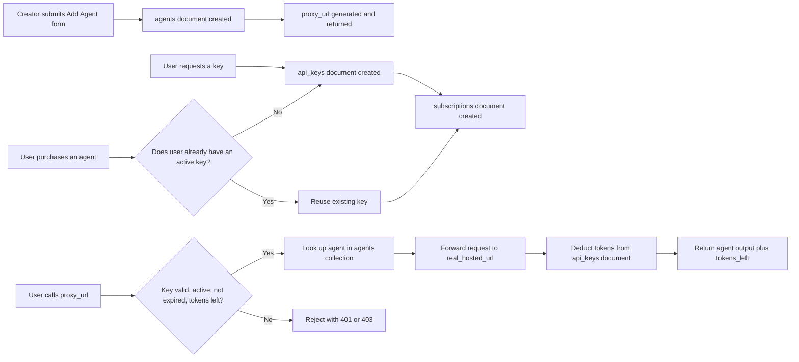
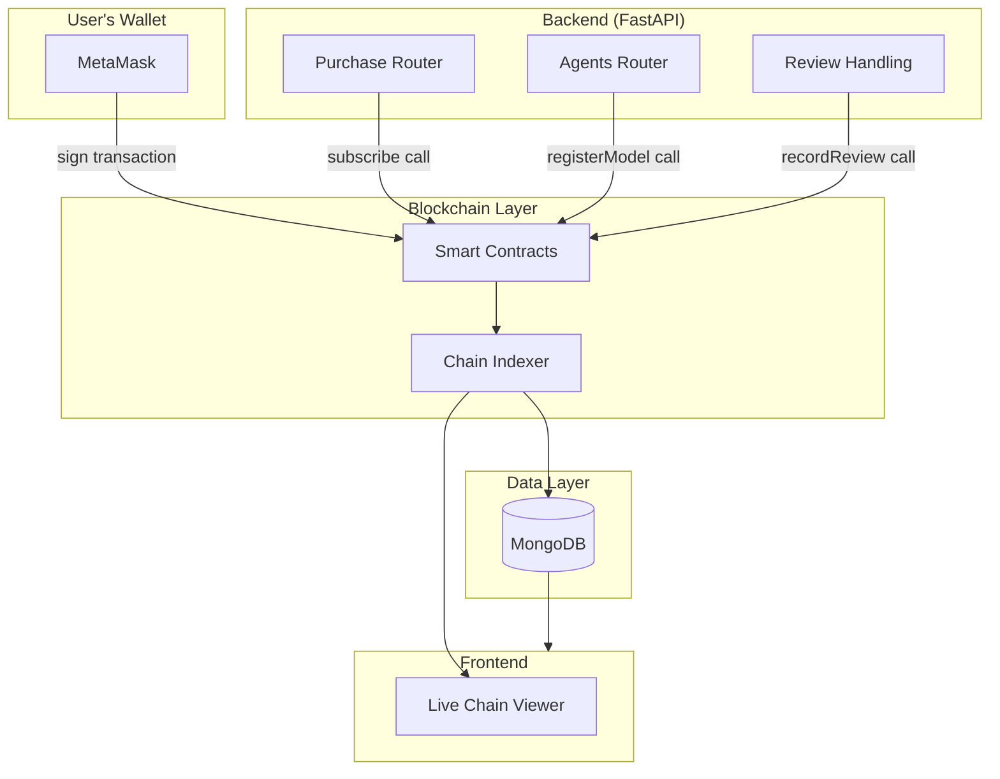
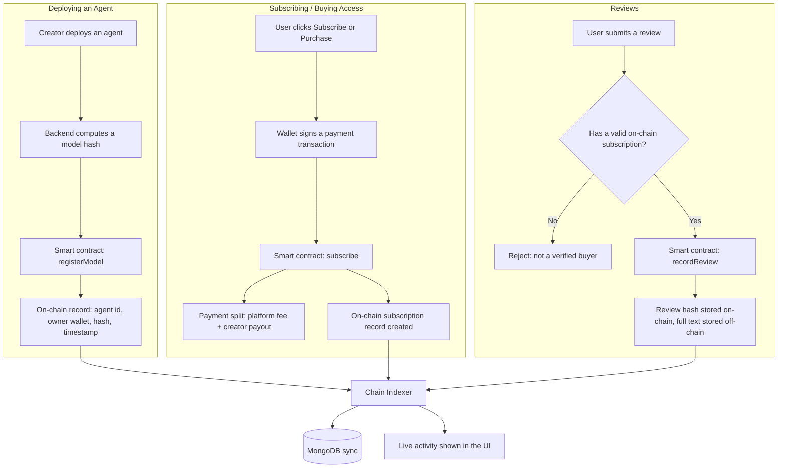
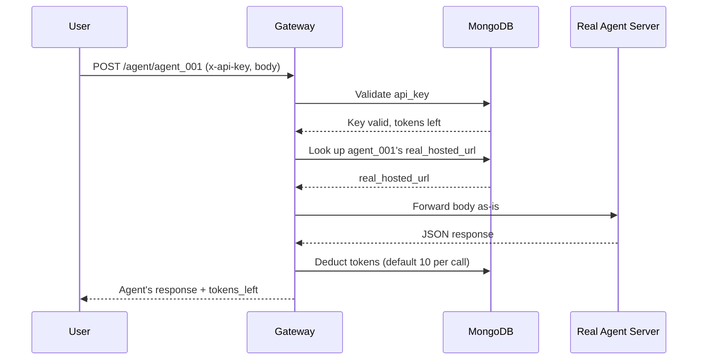
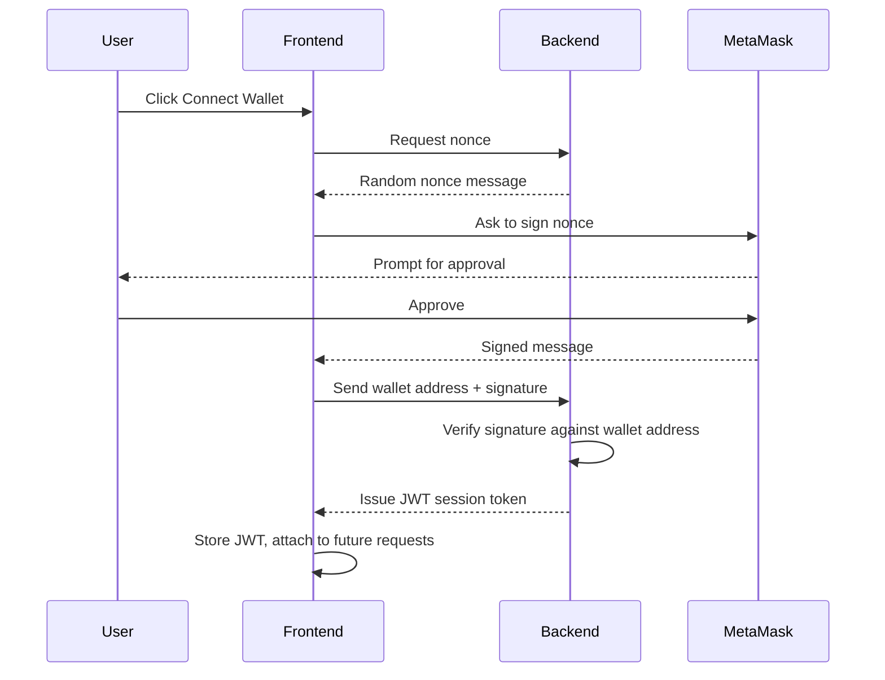
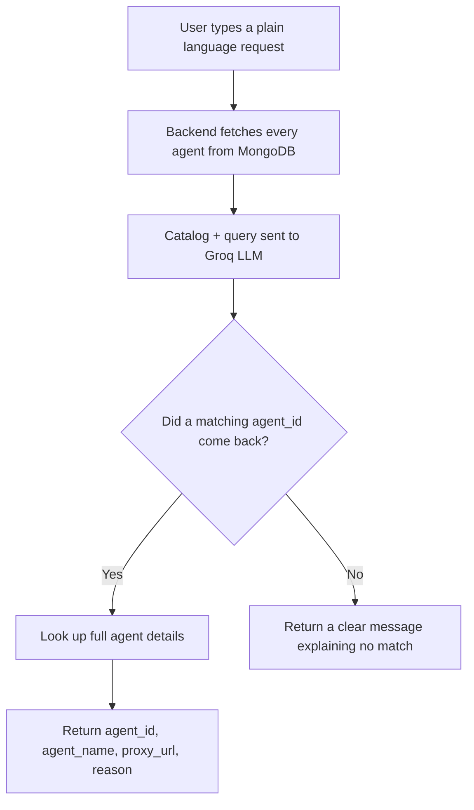
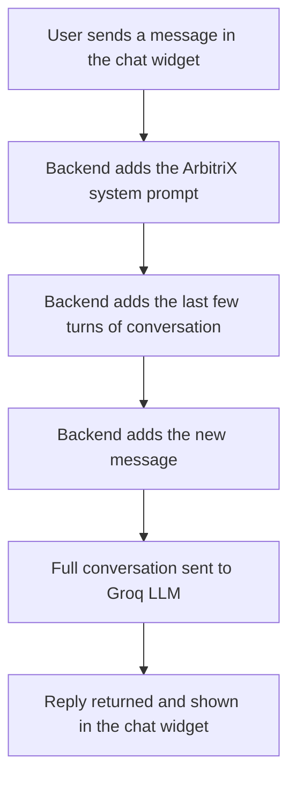

# ArbitriX Architecture Document

Discover AI agents, search for the right one, subscribe to it, and call it through one gateway. This document explains how the system is built, how each part works, and how the pieces connect.

---

## Table of Contents

1. [Core Idea](#1-core-idea)
2. [System Architecture](#2-system-architecture)
3. [Backend Modules](#3-backend-modules)
4. [Database Design](#4-database-design)
5. [Authentication (API Key Model)](#5-authentication-api-key-model)
6. [Blockchain Architecture](#6-blockchain-architecture)
   - [6.1 Component View](#61-component-view)
   - [6.2 What Goes On-Chain and What Stays Off-Chain](#62-what-goes-on-chain-and-what-stays-off-chain)
   - [6.3 Where Blockchain Touches the Gateway](#63-where-blockchain-touches-the-gateway)
   - [6.4 Smart Contract Responsibilities](#64-smart-contract-responsibilities)
   - [6.5 Blockchain Flow](#65-blockchain-flow)
7. [Gateway and Proxy Flow](#7-gateway-and-proxy-flow)
8. [API Endpoints](#8-api-endpoints)
9. [Bonus Features Added](#9-bonus-features-added)
   - [9.1 JWT and MetaMask Based Login](#91-jwt-and-metamask-based-login)
   - [9.2 AI Powered Agent Search](#92-ai-powered-agent-search)
   - [9.3 In App Chatbot Assistant](#93-in-app-chatbot-assistant)
10. [Tech Stack Summary](#10-tech-stack-summary)
11. [Demo Walkthrough](#11-demo-walkthrough)

---

## 1. Core Idea

ArbitriX is one gateway server that sits in front of many AI agents. Each agent is hosted somewhere else, by a different creator, but a user never has to know or care where. They only ever talk to ArbitriX.

In simple words, think of ArbitriX as a hotel reception desk.

- The reception desk (the gateway) never moves.
- Every new guest (a new AI agent) just gets a new room number (an `agent_id`) added to the register (the database).
- Every visitor (a user) walks through the same front door (the gateway URL), shows an ID card (an API key), and gets sent to the right room.

Adding a new agent means adding one row to the database. It does not mean writing new code or redeploying the server.

### Flowchart: Core Idea

---

## 2. System Architecture

Simple explanation: the frontend never calls a real agent directly. Every request goes through the gateway. The gateway checks the database, and if the request is a normal agent call, it forwards that call to the real hosted URL and returns the answer. The AI helper layer is kept in its own folder because it reads agent data but never writes it, and it talks to an external LLM provider (Groq) instead of the real agents. The blockchain layer is shown here as a connected but separate piece, since it does not touch every request, only the ones involving payment, ownership, or reviews.

---

## 3. Backend Modules

The backend is one FastAPI application split into small modules, each with one job.

| Module | File | Responsibility |
|---|---|---|
| Agents | `app/routers/agents.py`, `app/services/agent_service.py` | Register new agents, list agents, fetch a single agent's public details |
| API Keys | `app/routers/keys.py`, `app/services/key_service.py` | Generate keys, regenerate keys, validate keys, deduct tokens |
| Purchase | `app/routers/purchase.py` | Handles the "Generate API Key" action when a user buys access to an agent |
| Gateway / Proxy | `app/routers/gateway.py`, `app/services/proxy_service.py` | Forwards a request to the real agent and returns its response |
| Keep-alive | `app/services/keepalive_service.py` | Pings the server itself every few minutes so a free hosting plan does not go to sleep |
| Security utils | `app/utils/security.py` | Generates sequential agent IDs and random API keys |
| AI Recommender | `ai_agents/recommend_agent.py` | Finds the best matching agent for a free text search query |
| AI Chatbot | `ai_agents/chatbot_agent.py` | Answers user questions about how ArbitriX works |

### Flowchart: Request Flow Through the Backend

---

## 4. Database Design

ArbitriX stores its data in MongoDB. There are four main collections.

| Collection | Purpose | Key Fields |
|---|---|---|
| `agents` | One document per registered agent | `agent_id`, `agent_name`, `description`, `sector`, `real_hosted_url`, `owner`, `price_per_call`, `input_example`, `output_example`, `created_at` |
| `api_keys` | One document per issued key | `api_key`, `username`, `tokens_left`, `expires_on`, `status` |
| `subscriptions` | Records which user purchased which agent | `username`, `agent_id`, `purchased_at` |
| `counters` | Keeps a running number so agent IDs read as `agent_001`, `agent_002`, and so on | `name`, `value` |

Important design point: `real_hosted_url` is only ever stored and read on the backend. It is never included in any response sent to the frontend. Only `proxy_url` is shown to users, which is how the real location of an agent stays hidden.

### Flowchart: Data Flow

---

## 5. Authentication (API Key Model)

Every user is identified today by a `username` and an `api_key`. When a key is created:

- It gets a default token quota (for example 1000 tokens).
- It gets an expiry date (for example 30 days later).
- It is marked `active`.

Every call to `/agent/{agent_id}` must include the key in the `x-api-key` header. The gateway checks, in order:

1. Does this key exist?
2. Is its status `active`?
3. Has it expired?
4. Are there tokens left?

If any check fails, the request is rejected before it ever reaches the real agent. Section 9.1 explains the wallet based login layer designed to sit in front of this key system.

---

## 6. Blockchain Architecture

ArbitriX uses blockchain only where trust actually matters. It does not put the whole application on-chain, since that would be slow and expensive for things like running an AI model or storing large files. Instead, blockchain is reserved for four jobs: proving who owns a model, proving who paid for what, proving a review is genuine, and keeping a permanent record of all three.

Note on current status: the backend in this repository runs on MongoDB and does not yet include live smart contract calls. This section describes the blockchain layer as designed, so it can be added on top of the existing gateway without changing how the gateway itself works.

### 6.1 Component View

This diagram shows how the blockchain layer fits alongside the backend, separate from the main request path described in section 2, but feeding into the same database.

Simple explanation: the backend never edits the blockchain directly on its own, it asks the user's wallet to sign and send a transaction to a smart contract. The smart contract is what actually records the event. A chain indexer constantly watches the blockchain and copies new events into MongoDB, and those same events also feed a live viewer panel in the frontend, so blockchain activity is visible in real time instead of hidden behind a technical log.

### 6.2 What Goes On-Chain and What Stays Off-Chain

| Stays On-Chain (needs proof) | Stays Off-Chain (needs speed) |
|---|---|
| Model ownership record | The actual AI model files |
| Payment and subscription transactions | Docker images and build files |
| A hash (fingerprint) of the model | API responses from calling the model |
| Proof that a review came from a paying user | Running the model itself |
| Key marketplace events | Large usage logs and analytics |
| | API keys, stored only as hashes if placed on-chain at all |

### 6.3 Where Blockchain Touches the Gateway

- **Deploying an agent**: only a fingerprint (hash) of the agent and its owner's wallet address would go on-chain, never the agent's real code or real hosted URL.
- **Subscribing / purchasing access**: a smart contract can automatically split an incoming payment between the platform and the creator, and store a permanent subscription record. Right now, `purchase-agent` records this off-chain in the `subscriptions` collection, this is the seam where a smart contract call would be added.
- **Leaving a review**: a smart contract can check that the reviewer's wallet actually holds a subscription record before the review is allowed to be submitted, which stops fake reviews.
- **Chain Indexer**: a background service that watches the blockchain for these events and copies them into MongoDB, so the rest of the app can read fast, normal database queries instead of querying the blockchain on every page load.

### 6.4 Smart Contract Responsibilities

Each of these is a single function a smart contract would expose, and each one maps to one action described above.

| Function | Triggered By | What It Records On-Chain |
|---|---|---|
| `registerModel(agentId, ownerWallet, modelHash)` | Creator deploys an agent | Agent id, owner wallet, hash, timestamp |
| `subscribe(agentId, plan)` | User buys or renews access | Payment split, subscription start and expiry |
| `withdrawEarnings(creatorWallet)` | Creator withdraws revenue | Payout transaction |
| `recordReview(agentId, subscriberWallet, reviewHash, rating)` | User submits a review | Review hash, wallet, rating |
| `discontinueModel(agentId, deadline)` | Creator removes an agent | Shutdown notice and deadline for existing subscribers |

### 6.5 Blockchain Flow

Simple explanation: deploying an agent puts only a fingerprint on the chain, not the agent itself. Paying for access happens through the wallet, and the smart contract splits that payment automatically between the platform and the creator. Leaving a review requires proof of a real purchase first. A background indexer watches all of this and mirrors it into the normal database, so the app stays fast while trust still lives on the chain.

---

## 7. Gateway and Proxy Flow

The `/agent/{agent_id}` endpoint is a pass through. It does not care what shape the request or response is in. One agent might expect `{"text": "..."}`, another might expect a completely different structure such as `{"origin": "...", "destinations": [...]}`. The gateway simply takes whatever JSON body it receives, sends it to the agent's real hosted URL, and returns whatever JSON comes back, with `tokens_left` added to the reply.

If the real agent times out, returns an error, or sends back invalid JSON, the gateway returns a clear error (504, 502, or similar) instead of passing a broken response to the user.

---

## 8. API Endpoints

### 8.1 Agents

| Method | Endpoint | Description |
|---|---|---|
| POST | `/add-agent` | Register a new agent and receive its `agent_id` and `proxy_url` |
| GET | `/agents` | List every registered agent, used by the Discover page |
| GET | `/agents/{agent_id}` | Get one agent's public details |

### 8.2 API Keys

| Method | Endpoint | Description |
|---|---|---|
| POST | `/generate-key` | Issue a new API key for a username |
| POST | `/regenerate-key` | Invalidate the old key and issue a new one, carrying tokens over |

### 8.3 Purchase

| Method | Endpoint | Description |
|---|---|---|
| POST | `/purchase-agent` | Buy access to an agent, reuse or create a key, and record the purchase |

### 8.4 Gateway

| Method | Endpoint | Description |
|---|---|---|
| POST | `/agent/{agent_id}` | Call a specific agent through the gateway |

### 8.5 AI Helper Layer

| Method | Endpoint | Description |
|---|---|---|
| POST | `/ai/recommend-agent` | Search in plain language and get the best matching agent |
| POST | `/ai/chatbot` | Ask the in app assistant a question about how ArbitriX works |

---

## 9. Bonus Features Added

This section covers three additions layered on top of the core gateway: wallet based login with JWT, AI powered agent search, and the in app chatbot.

### 9.1 JWT and MetaMask Based Login

The goal of this layer is to remove passwords entirely and let a user's crypto wallet act as their identity.

In simple words, it works like signing a note with a key you already own, instead of typing a password. The backend never sees or stores anything secret from the wallet, it only checks that a signature matches a known wallet address.

Steps:

1. The user clicks Connect Wallet in the frontend.
2. The backend generates a one time random message, called a nonce, and sends it to the frontend.
3. MetaMask asks the user to sign that nonce. Signing does not cost gas, it is not a blockchain transaction, just a proof of ownership.
4. The signed message goes back to the backend.
5. The backend checks that the signature matches the claimed wallet address.
6. If it matches, the backend issues a JWT, a signed session token, back to the frontend.
7. The frontend stores this JWT and attaches it to every future request, in place of a username and password.

Once a JWT session exists, it can be linked to the existing `api_keys` collection, so a wallet address effectively owns one or more API keys, instead of a plain username owning them. This same wallet is also what signs the payment transactions described in section 6, so login identity and payment identity end up being the same wallet.

Why this matters in plain words: a password can be guessed or leaked. A wallet signature proves ownership of a private key without ever exposing that key, and the JWT that follows is what keeps the user logged in without asking them to sign a message on every single request.

### 9.2 AI Powered Agent Search

Instead of only browsing a list, a user can type what they need in plain language, and the system finds the closest matching agent on its own.

This is powered by the `/ai/recommend-agent` endpoint. In simple words, it reads the description of every registered agent, hands that list along with the user's question to an LLM (Groq, model `gpt-oss-20b`), and asks it to pick the single best match, plus up to two runner up options.

Steps:

1. The user types a query, for example "I need something to optimize shipping routes."
2. The backend pulls every agent's name, description, sector, and price from MongoDB.
3. This catalog and the query are sent together to the LLM with clear instructions to reply with only a small JSON object.
4. The LLM returns the best matching `agent_id`, a one line reason, and up to two runner up IDs.
5. The backend looks up the full details for that agent and returns its `proxy_url` directly, so the frontend can link straight to it.
6. If no agent fits the request, or if no agents exist yet, the system responds clearly instead of failing.

Why this matters in plain words: a marketplace with many agents is hard to browse manually. This turns a search box into something closer to asking a knowledgeable person which tool fits the job, and it always answers using only agents that actually exist in the database, never a made up one.

### 9.3 In App Chatbot Assistant

A chat panel sits inside the app and answers questions about how ArbitriX itself works, for example how to add an agent, how the proxy model works, or where to find API access settings.

This is powered by the `/ai/chatbot` endpoint. A fixed system prompt describes the whole product (Workspace, Discover, the proxy and API key model, Portfolio, wallet payments) and that prompt is combined with the ongoing conversation before being sent to the LLM.

Steps:

1. The user sends a message, along with the recent chat history.
2. The backend builds a message list: first the system prompt describing ArbitriX, then the last few turns of conversation, then the new message.
3. This full list is sent to Groq.
4. The reply comes back and is shown directly in the chat widget.

Why this matters in plain words: instead of a static help page, a user gets a direct answer in the same window they are already working in, without leaving the app to search documentation.

---

## 10. Tech Stack Summary

| Layer | Technology Used |
|---|---|
| Backend framework | FastAPI (Python) |
| Database | MongoDB Atlas, accessed through Motor (async driver) |
| Outbound HTTP calls | httpx, used both for calling real agents and for calling Groq |
| AI provider | Groq, model `gpt-oss-20b`, plain REST `/chat/completions` calls |
| Hosting | Render, free tier, with a keep-alive pinger to prevent the service from sleeping |
| Planned login layer | Wallet signature verification (MetaMask) plus JWT sessions |
| Planned blockchain layer | Smart contracts for ownership, payment split, and review verification, plus a chain indexer syncing events into MongoDB |

---

## 11. Demo Walkthrough

1. Explain: one server, many agents, adding an agent never touches the code.
2. Register Agent 1 with `POST /add-agent`, show the returned `proxy_url`.
3. Generate a key with `POST /generate-key`, show `tokens_left` and `expires_on`.
4. Call Agent 1 through `POST /agent/agent_001` with the key, show a real reply and tokens decreasing.
5. Register Agent 2, a completely different real URL, show a brand new `proxy_url` with no code changes.
6. Type a plain language request into `POST /ai/recommend-agent`, show it point at the correct agent.
7. Ask the chatbot a product question through `POST /ai/chatbot`, show a direct answer.
8. Drain the tokens, show the 403 token limit response.
9. Call `POST /regenerate-key`, show the old key rejected and the new key carrying the same token balance forward.
10. If the wallet and blockchain layer is wired in, connect MetaMask, sign the nonce, show the JWT issued, then subscribe to an agent and show the payment and subscription record appear on-chain and mirrored into MongoDB.
