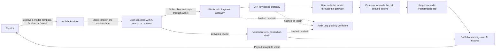
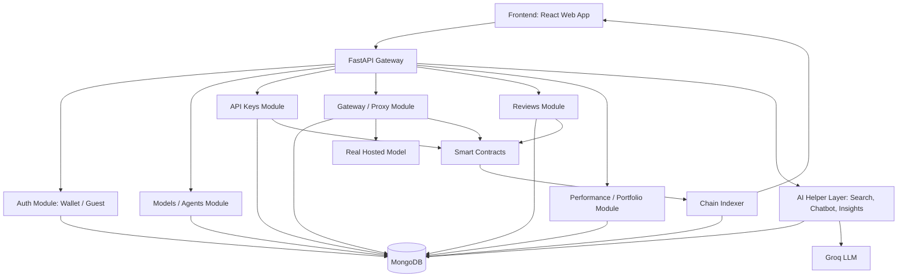

<div align="center">

# ArbitriX
### Blockchain Based AI Economy

**Discover an AI model. Verify it. Deploy it. Subscribe to it. Use it. Get paid for it, transparently.**


</div>

---

> **Note:** This README covers the product, the problem it solves, the business model, and the features. For the full technical breakdown (every backend module, every database collection, the gateway flow, the token system, the wallet login flow, and the blockchain design with diagrams), please read **[ARCHITECTURE.md](https://github.com/Victowolf/ArbitriX/blob/main/ArbitriX_Architecture.md)**.

---

## Table of Contents

- [1. Problem Statement](#1-problem-statement)
- [2. Our Solution](#2-our-solution)
- [3. Solution Overview](#3-solution-overview)
- [4. Business Model](#4-business-model)
- [5. Features](#5-features)
- [6. Bonus Features Implemented](#6-bonus-features-implemented)
- [7. Tech Stack](#7-tech-stack)
- [8. Architecture](#8-architecture)
- [9. Project Structure](#9-project-structure)
- [10. Backend Code Structure](#10-backend-code-structure)
- [11. Database Design (Short Version)](#11-database-design-short-version)
- [12. Getting Started](#12-getting-started)
  - [12.1 Backend Setup](#121-backend-setup)
  - [12.2 Frontend Setup](#122-frontend-setup)
  - [12.3 Environment Variables](#123-environment-variables)
- [13. Testing the API in Swagger UI](#13-testing-the-api-in-swagger-ui)
- [14. Demo Walkthrough](#14-demo-walkthrough)
- [15. Roadmap](#15-roadmap)

---

## 1. Problem Statement

Is the AI economy really as promising as it sounds? Right now, four things get in the way:

- **AI models are fragmented.** Thousands of models are spread across different platforms, repositories, and providers, which makes it hard to discover and compare the right one.
- **Trust is hard to establish.** Users often cannot easily verify a model's ownership, authenticity, performance, reviews, or actual usage before committing to it.
- **Deployment isn't simple.** Hosting a model is only the beginning. Creators still need API access, authentication, inference code, and usage monitoring built around it.
- **Monetization is complicated.** Model creators run into payment problems, currency barriers, and limited ways to reach users and reliably get paid for their work.

The real gap is going from *"I have an AI model"* to *"I can deploy it, let people use it, and get paid for it, without friction."*

## 2. Our Solution

ArbitriX is a blockchain powered AI marketplace that simplifies model deployment, verification, discovery, subscription, and monetization, all in one place.

- **Blockchain based authentication.** A MetaMask based login gives every user decentralized security over their account and funds, no passwords involved.
- **Model deployment.** A creator clicks setup and submits a hosted endpoint, a Docker image, or connects directly from GitHub. ArbitriX handles everything after that: API key generation, rate limiting, inference code, and usage monitoring.
- **Model discovery with AI search and a chatbot.** Users can search in plain language and get recommendations based on use case and budget, or ask the built-in chatbot for the latest news on trending models and new advancements.
- **Performance and portfolio.** Creators get AI powered, on-chain analysis of their model's performance and token usage, plus recommendations tailored to their profile to help grow their AI business.
- **Blockchain payment gateway.** Users subscribe to models and payments go straight into the creator's wallet, cutting out currency barriers and high cross-border banking fees.
- **Audit log system.** Every model deployment, subscription, token usage record, and review is hashed on-chain. This gives anyone public proof they can verify, which builds real transparency and trust between users and developers.

## 3. Solution Overview



In plain words: a creator never has to build and secure their own public API, and a user never has to just trust that a model, a review, or a payment is real. ArbitriX handles discovery, secure access, usage tracking, and on-chain proof, all in one product.

## 4. Business Model

ArbitriX earns money in two ways.

**1. Platform fee on subscriptions.** ArbitriX takes a percentage cut of the revenue that creators generate through model subscriptions. Creators choose between Free, Plus, and Pro plans, each with increasing deployment limits and platform benefits, and higher plans come with a lower platform fee.

**2. Model advertising.** Creators can pay for featured listings, sponsored placements, and promoted discovery to get their model in front of more users.

**Illustrative Year 1 projection, based on an estimated 1,000 users:**

| Revenue source | Assumption | Annual amount |
|---|---|---|
| Platform cut on subscriptions | 200 paid users x $10/month x 10% platform cut | $2,400 |
| Platform plan fees from creators | 50 creators x $10/month average platform plan | $6,000 |
| Model advertising | Featured listings and promoted discovery | ~$3,000 |
| **Estimated annual platform revenue** | | **≈ $11,400** |

This is an early, conservative estimate meant to show the model works even at a small user base. Both subscription volume and the number of paying creators are the two levers that scale this revenue as the platform grows.

## 5. Features

| Area | What it does |
|---|---|
| **Wallet or guest login** | Sign in by connecting a wallet, or jump in instantly as a guest to try the platform with no account needed. |
| **Model discovery** | Search and filter models by name, category, use case, description, creator, or technology. |
| **Model deployment** | Creators can deploy a model using a ready-made template, by uploading a Docker image, or by connecting a GitHub repo. |
| **One gateway for every model** | Every model is reached through the same ArbitriX URL. Adding a new model never requires new backend code. |
| **Subscriptions and API keys** | Users subscribe monthly or yearly, and instantly get an API key plus copy-paste Node.js and Python code to start calling the model. |
| **API key security** | The key is shown once. Only a hashed version is stored. Users can regenerate a key at any time without losing their subscription. |
| **Token based usage limits** | Every plan comes with a token quota. Every model call deducts tokens, and calls are blocked once the quota runs out. |
| **Safe model withdrawal** | A creator can only remove a model instantly if it has no active users. Otherwise, they must alert existing users and give them a deadline. |
| **Verified reviews** | Only users with an active subscription can leave a review, so reviews can't be faked by people who never actually used the model. |
| **Performance tracking** | Every user can see token usage for models they deployed (self) and models they subscribed to. |
| **Portfolio and earnings** | Creators get a dashboard of total earnings, per-model earnings, and on-chain transaction history. |
| **Platform plans** | Free, Plus, and Pro plans, each with a different platform fee and deployment capacity. Higher plans mean lower fees. |

## 6. Bonus Features Implemented

On top of the core marketplace, these extra features have already been built:

- **Wallet based login (MetaMask + JWT):** instead of a password, the user's wallet signs a one-time message to prove identity, and the backend issues a JWT session from that. No secret ever leaves the wallet.
- **AI powered agent search:** a user can type a plain language request such as "I need something to optimize shipping routes," and an LLM reads the full model catalog and points to the best match, plus up to two runner-up options.
- **In-app chatbot assistant:** a chat panel inside the app answers questions about how ArbitriX itself works, and also shares news on trending models and new advancements, without the user needing to leave the app.
- **AI generated review summaries:** instead of reading hundreds of reviews, a creator gets a short AI-written paragraph summarizing what users think.
- **AI powered portfolio insights:** the platform looks at a creator's usage and earnings data and suggests plain-English actions, such as lowering a price or highlighting a model that is growing fast.
- **On-chain audit log:** every deployment, subscription, token usage record, and review is hashed on-chain, so anyone can independently verify platform activity instead of just trusting a dashboard.
- **Live chain viewer:** a panel on the home page shows blockchain activity as it happens: model deployed, model subscribed, payment received, review submitted, so blockchain isn't just working silently in the background.

## 7. Tech Stack

<div align="center">


</div>

| Layer | Technology | Purpose |
|---|---|---|
| Frontend | React.js, TypeScript, Tailwind CSS | Login page, Workspace, Enterprise, Portfolio, and the live Chain Viewer |
| Backend | Python, FastAPI | Every API route, plus auto-generated Swagger docs at `/docs` |
| AI | Groq API, model GPT-OSS-120B | Powers AI Search, the chatbot, review summaries, and portfolio insights |
| Blockchain and auth | MetaMask, Ethereum / EVM, Solidity, smart contracts | Wallet based authentication, on-chain payments, ownership, and review verification |
| Database and infrastructure | MongoDB, Docker, GitHub, cloud hosting, CI/CD | Stores users, models, subscriptions, keys, reviews, and usage logs |
| Payments, analytics, monitoring | Blockchain payments, on-chain analytics, usage monitoring, performance analytics, on-chain audit logs | Powers the Performance tab, the Portfolio tab, and the transparency layer |

## 8. Architecture

The full technical design, including every backend module, every MongoDB collection, the gateway/proxy flow, the token limit system, the wallet login sequence, and the complete blockchain design, lives in a separate file so this README stays easy to read.

**[View ARCHITECTURE.md for the complete technical design](https://github.com/Victowolf/ArbitriX/blob/main/ArbitriX_Architecture.md)**

A quick summary of how a request travels through the system:



## 9. Project Structure

```
arbitrix/
├── backend/                  # FastAPI application (see section 10)
├── frontend/                 # React + TypeScript web app (see section 12 for setup)
├── README.md                 # You are here
└── ARCHITECTURE.md           # Full technical architecture
```

## 10. Backend Code Structure

```
backend/
├── main.py                     # FastAPI app entrypoint, mounts all routers
├── config.py                   # Environment variables, MongoDB connection string
├── requirements.txt
│
├── db/
│   └── mongo.py                 # MongoDB client setup (Motor)
│
├── models/                      # Pydantic schemas (request/response shapes)
│   ├── user.py
│   ├── agent.py                 # (a model listed on the marketplace)
│   ├── subscription.py
│   └── review.py
│
├── app/
│   ├── routers/                 # One file per feature, auto-shown in Swagger
│   │   ├── auth.py               # Login (wallet / guest), token check
│   │   ├── agents.py              # Register, list, and view models/agents
│   │   ├── keys.py                 # Generate / regenerate API keys
│   │   ├── purchase.py             # Subscribe / buy access to a model
│   │   ├── gateway.py               # Proxy: forwards calls to the real model
│   │   ├── reviews.py                # Submit and list reviews
│   │   ├── performance.py             # Token usage stats
│   │   ├── portfolio.py                # Earnings and AI insights
│   │   ├── plans.py                     # Free / Plus / Pro plan info
│   │   └── admin.py                      # Seed and reset mock data
│   │
│   ├── services/                 # Business logic, kept separate from routing
│   │   ├── auth_service.py
│   │   ├── agent_service.py
│   │   ├── key_service.py
│   │   ├── subscription_service.py
│   │   ├── proxy_service.py       # Forwards the request, deducts tokens
│   │   ├── ai_service.py           # Talks to Groq for search, chat, summaries and insights
│   │   ├── keepalive_service.py      # Pings itself so the free host doesn't sleep
│   │   └── mock_data_service.py
│   │
│   └── utils/
│       └── security.py            # Generates agent IDs and random API keys
│
└── ai_agents/                   # Kept separate because it only reads data
    ├── recommend_agent.py         # Plain language search over the model catalog
    └── chatbot_agent.py            # In-app assistant about how ArbitriX works
```

## 11. Database Design (Short Version)

MongoDB stores everything as documents in a few collections. The full field-by-field breakdown is in [ARCHITECTURE.md](./ARCHITECTURE.md#4-database-design), here is the short version:

| Collection | What it holds |
|---|---|
| `users` | Accounts, guest or wallet login, role (creator/consumer) |
| `agents` (or `models`) | One document per listed AI model, including its real hosted URL (never sent to the frontend) |
| `api_keys` | One document per issued key, with tokens left, expiry, and status |
| `subscriptions` | Which user subscribed to which model, and when |
| `reviews` | Rating and text, marked `verified_purchase` if the user has an active subscription |
| `usage_logs` | One entry per call, used to power the Performance tab |
| `counters` | Keeps agent IDs readable, like `agent_001`, `agent_002` |

## 12. Getting Started

### 12.1 Backend Setup

```bash
# 1. Move into the backend folder
cd backend

# 2. Create and activate a virtual environment (recommended)
python -m venv venv
source venv/bin/activate        # on Windows: venv\Scripts\activate

# 3. Install dependencies
pip install fastapi uvicorn motor pydantic python-jose passlib httpx

# 4. Run the server
uvicorn main:app --reload

# 5. Open Swagger UI in your browser
http://localhost:8000/docs
```

### 12.2 Frontend Setup

```bash
# 1. Move into the frontend folder
cd frontend

# 2. Install dependencies
npm install

# 3. Run the dev server
npm run dev

# 4. Open the app in your browser
http://localhost:5173
```

### 12.3 Environment Variables

Create a `.env` file inside `backend/`:

```env
MONGO_URI=your_mongodb_connection_string
DB_NAME=arbitrix
JWT_SECRET=your_jwt_secret_key
JWT_EXPIRE_MINUTES=60
GROQ_API_KEY=your_groq_api_key
GROQ_MODEL=gpt-oss-120b
DEFAULT_TOKEN_LIMIT=1000
API_KEY_EXPIRY_DAYS=30
CHAIN_RPC_URL=your_testnet_rpc_url
CONTRACT_ADDRESS=your_deployed_contract_address
CHAIN_INDEXER_INTERVAL_SECONDS=15
```

Create a `.env` file inside `frontend/`:

```env
VITE_API_BASE_URL=http://localhost:8000
```

## 13. Testing the API in Swagger UI

1. Run `POST /admin/seed-mock-data` to fill the database with sample creators, models, and reviews.
2. Run `POST /auth/guest` (or connect a wallet through `/auth/wallet`) and copy the `access_token` from the response.
3. Click **Authorize** at the top of the Swagger page and paste `Bearer <token>`.
4. Try `GET /models` (or `/agents`) to browse the marketplace.
5. Try `POST /subscriptions` (or `/purchase-agent`) on any model to get an API key.
6. Try `POST /inference` (or `POST /agent/{agent_id}`) using that key to simulate calling the model.
7. Try `POST /models/{id}/reviews` to leave a review.
8. Try `GET /portfolio/insights` while logged in as the creator to see the AI generated recommendations.

No frontend and no wallet are required to test the full loop, everything above works directly from `/docs`.

## 14. Demo Walkthrough

1. Explain the idea: one gateway, many models, adding a model never touches the backend code.
2. Register a model and show the returned `proxy_url`.
3. Generate an API key and show `tokens_left` and `expires_on`.
4. Call the model through the gateway and show a real reply with tokens going down.
5. Register a second model with a completely different real URL, and show a new `proxy_url` with zero code changes.
6. Type a plain language request into the AI search endpoint and show it point to the right model.
7. Ask the chatbot a product question and show a direct answer.
8. Drain the tokens on purpose and show the limit-reached response.
9. Regenerate the API key and show the old one gets rejected while the token balance carries over.
10. Connect MetaMask, sign the login message, subscribe to a model, and show the payment and subscription appear on-chain and mirrored into MongoDB, along with the live chain viewer updating in real time.

## 15. Roadmap

- [x] Marketplace core: list, discover, subscribe, get API key, call model
- [x] Token based usage limits and usage logging
- [x] Verified reviews tied to real subscriptions
- [x] AI powered search, chatbot, review summaries, and portfolio insights
- [x] MetaMask wallet login with JWT sessions
- [ ] Smart contracts for ownership, payments, and review verification live on a testnet
- [ ] Chain indexer syncing on-chain events into MongoDB
- [ ] Live chain viewer fed by real on-chain events
- [ ] Model advertisement and featured placement revenue stream
